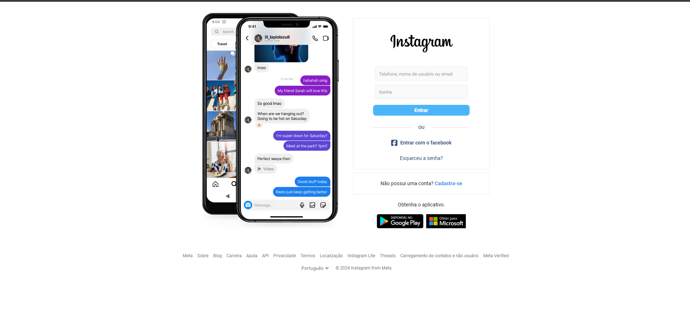

# Projeto Instagram Clone

Este projeto é uma recriação da interface de login do Instagram. Ele foi desenvolvido utilizando HTML, CSS e JavaScript para replicar o visual e a funcionalidade básica da página de login do Instagram.

## Demonstração

Abaixo você pode ver uma imagem de demonstração da projeto:



## Estrutura do Projeto

O projeto está organizado da seguinte maneira:

- `index.html`: Arquivo principal da interface de login.
- `css/`: Diretório contendo arquivos CSS para estilos.
  - `styles.css`: Arquivo principal de estilos.
  - `mediaQuery.css`: Arquivo de estilos responsivos.
- `assets/`: Diretório contendo imagens e ícones usados na página.
- `Js/`: Diretório contendo arquivos JavaScript.
  - `script.js`: Arquivo principal de scripts.

## Funcionalidades

- Formulário de login com campos para nome de usuário e senha.
- Opção de login com Facebook.
- Link para recuperação de senha.
- Link para cadastro de nova conta.
- Botões para download do aplicativo no Google Play e Microsoft Store.

## Tecnologias Utilizadas

- HTML5
- CSS3
- JavaScript

## Como Executar o Projeto

1. Clone este repositório em sua máquina local.
   ```sh
   git clone https://github.com/seu-usuario/instagram-clone.git
   ```
2. Navegue até o diretório do projeto.
   ```sh
   cd instagram-clone
   ```
3. Abra o arquivo `index.html` em seu navegador preferido.

## Contribuições

Contribuições são bem-vindas! Se você tiver alguma sugestão ou encontrar algum problema, sinta-se à vontade para abrir uma issue ou enviar um pull request.

## Licença

Este projeto está licenciado sob a [MIT License](LICENSE).

---
